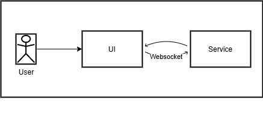
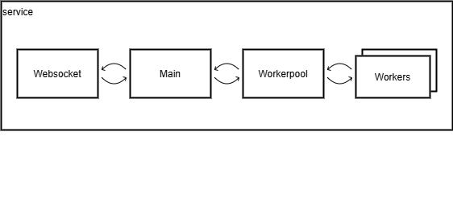
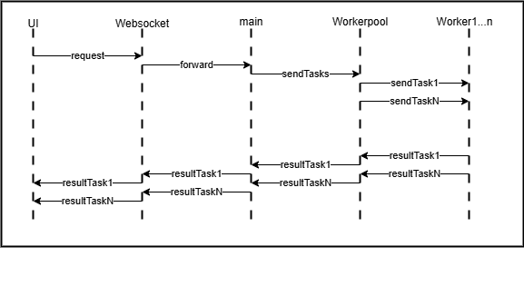

# parallel-mandelbrot-set

This project implements a Mandelbrot set generator with a web-based UI that communicates in real-time with a backend service using WebSockets. The backend service breaks the image into blocks processed in parallel by a worker pool.

---

## Architecture Overview

The system consists of two main parts:

- **UI**: A web interface where users request Mandelbrot image generation and receive partial results progressively.
- **Service**: The backend service that manages the generation process, breaking the image into blocks, dispatching tasks to workers, and sending computed blocks back to the UI.

*Figure 1: Main Architecture Overview*

---

## Service Components

Inside the backend service, several components coordinate to generate the Mandelbrot set efficiently:

- **MainClass**: Splits the Mandelbrot image into multiple blocks and manages task creation and result aggregation.
- **WorkerPool**: Manages a pool of worker threads/processes, dispatching tasks as workers become available.
- **Workers**: Compute the Mandelbrot block assigned to them.
- **WebSocket Server**: Handles real-time communication between the UI and the service.

*Figure 2: Service Internal Components*

---

## Sequence Diagram: Mandelbrot Generation Flow

This sequence diagram shows the detailed flow of messages and data:

1. UI sends a generation request to the service via WebSocket.
2. The service’s MainClass splits the image into blocks and submits tasks to the WorkerPool.
3. WorkerPool dispatches tasks to workers as they become available.
4. Workers compute their blocks and send results back.
5. The service sends partial results back to the UI in real-time.

*Figure 3: Sequence Diagram*

---

## How to Run

> - Clone the repo
> - Run `npm install`
> - Run `npm run start`
> - Open the frontend at `http://localhost:3000`
